<p align="center">
  
</p>

### Philip Paz

AI agents now read, decide, and act on their own. I frankly did not like that,
so I built a small annoyance for them.

**[Recusal](https://github.com/philpaz/recusal)** checks the evidence before an agent's
tool call runs. Allow, retry, or refuse. No model in the decision, same evidence,
same verdict. A hand on the reins, and a record for when a human comes back.

[](https://pypi.org/project/recusal/)
[](https://github.com/philpaz/recusal/actions/workflows/ci.yml)
[](https://github.com/philpaz/recusal/blob/main/LICENSE)

```
pip install recusal
recusal demo
```

It won't change the order of magnitude of anything. It's nuggets, on purpose.
Contributions are welcome, and the [good first issues](https://github.com/philpaz/recusal/issues)
are a friendly place to start.

<details>
<summary>That hash in the terminal is real. Check it yourself.</summary>

The verdict above is [`verdict.txt`](verdict.txt), with LF line endings:

```
curl -s https://raw.githubusercontent.com/philpaz/philpaz/main/verdict.txt | sha256sum
```

It should print `9475c1b34e8b28069da5f2727701716611207c8983071ac57e31fcb513c1d883`.
Same evidence, same verdict.

</details>

<p align="center">
  
</p>

<p align="center"><a href="https://www.linkedin.com/in/philippaz/">LinkedIn</a></p>
